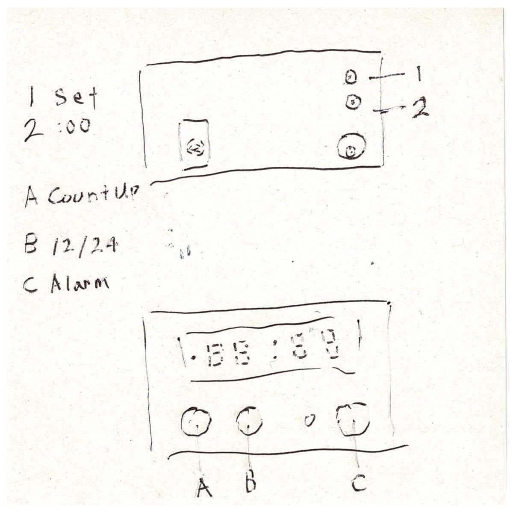

# digital-alarm-clock-ntp-extension

## ボタン配置

## フロー

### ブート

1. ネットワーク確立
2. NTP日時取得

### 電源投入直後

1. `Btn_1` High -> Low (時計を開始)

### 日時合わせ

1. ボタン操作回数を計算し、操作開始をスケジュール
    1. ssが正時となるタイミングにmm + 1回目のエミュレートが行われるようエミュレート開始タイミングをスケジュール
2. `Btn_1` High -> Low
3. `Btn_A` hh++
4. `Btn_B` mm++
